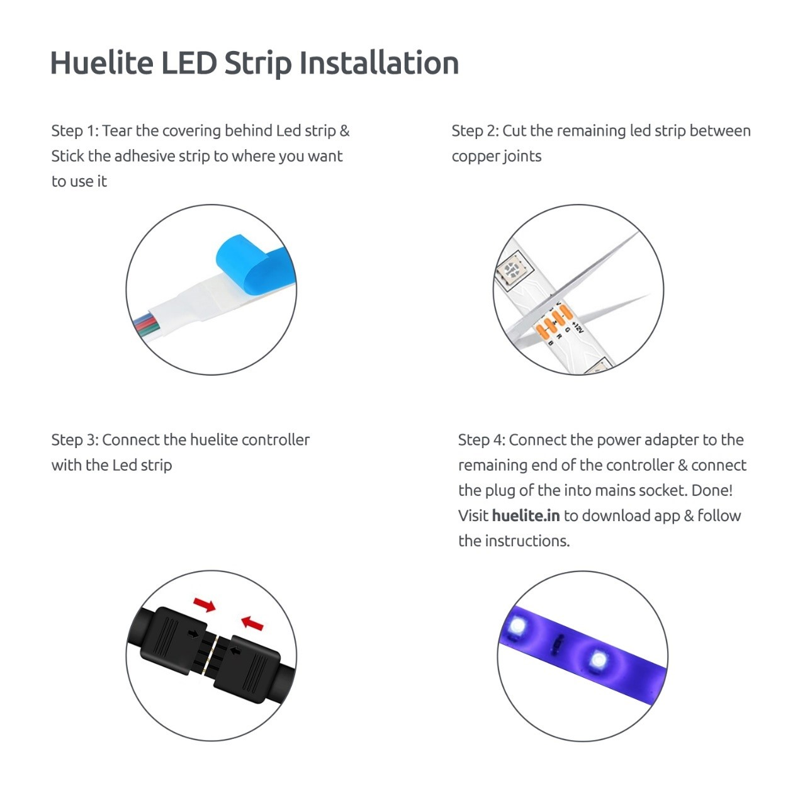

##### The product consists of 3 parts: A led strip, a Wi-Fi controller &amp; a Power adapter. It&#39;s a simple Plug &amp; Play Process. Let me guide you.

**Step 1:** Take the led strip and peel the double-sided tape at the back and stick it to the surface. (Note: Clean the surface of dust for better sticking)

**Step 2:** Cut the length you need at the yellow copper joints.

**Step 3:** Connect the Wi-Fi controller at one end with the led strip &amp; the other end with a power adapter.

**Step 4:** Now plug the adapter in the Ac supply. Done! Now download the Huelite app &amp; follow the instructions. Enjoy!!

