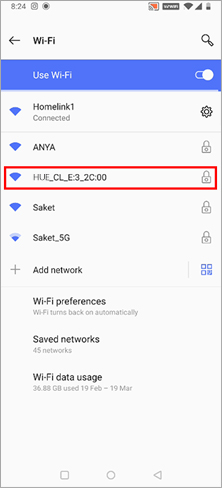
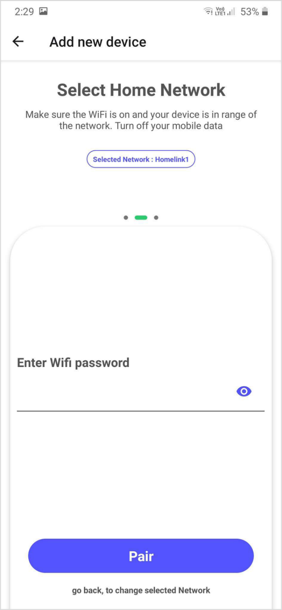
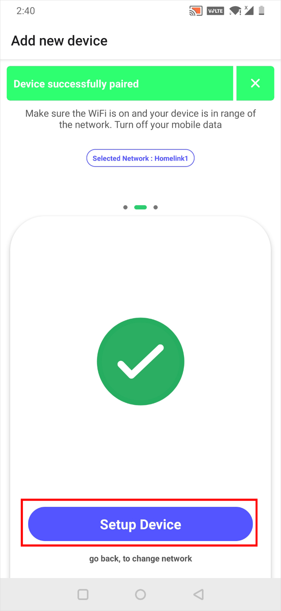

#### <step>Step 1:</step> Download the Huelite Application from Play Store/App Store respectively.

- [HUElite app for Ios](https://apps.apple.com/in/app/huelite/id1556187847)

- [HUElite app for Android](https://play.google.com/store/apps/details?id=com.sternet.huelite)

&nbsp;

Once the app is installed , register an account with Huelite, or login with an existing account.

&nbsp;

#### <step>Step 2:</step> Now start pairing by tapping on `go to Wi-fi settings` button.

&nbsp;

- If its your first start you will be landed on pairing screen, automatically, if not on pairing screen than, Click the **add device** icon on the top right-most corner of **dashboard**

&nbsp;

&nbsp;

&nbsp;

#### <step>Step 3:</step> In the Wi-Fi settings search find wifi naming `HUE_XXX_XX:XX`. Connect with this network by entering password `12345678`.

&nbsp;

- Assuming your smart light is plugged on. and mobile data turned off

&nbsp;

<NoteBox compId="faq_devicenotvisible1" heading="Troubleshoot">

&nbsp;

&nbsp;

<h4 style={{ marginTop: 10, marginBottom: 10 }}>
        FAQ: Huelite device doesn't appear in the avaliable Wi-Fi network list?
      </h4>
      <ul>
        <li>
          

            Make sure the Huelite device is installed within your home network
            range. (While pairing your smartphone is required to be within 5
            meter radius of huelite device providing no direct obstruction)
          

        </li>
        <li>
          

            If the device Wi-Fi doesnt appear in the Wi-Fi settings kindly
            factory reset the device. Check <Link to="/faq/howtoreset">here</Link>
          

        </li>
      </ul>
</NoteBox>

&nbsp;

&nbsp;

#### <step>Step 4:</step> Once connected, go back to the Huelite application and select your home network, `make sure your mobile data is turned off` while pairing.

&nbsp;

Wait for a few seconds for wifi scan results, and you will be redirected to choose your home Wi-Fi network. Select one by scrolling through the list & tap on “Next” device button.

&nbsp;

&nbsp;

<NoteBox compId="faq_homeNetworkNotVisible" heading="Troubleshoot">

&nbsp;

<h4 style={{ marginTop: 10, marginBottom: 10 }}>
        FAQ: My home Wi-Fi doesn’t appear in the list?
      </h4>
      <ul>
        <li>
          

            Make sure you are connecting with 2.4Ghz bandwidth network. Huelite lights connect to the 2.4Ghz band of Wi-Fi not 5Ghz. If you have more than one available network on your router this could mean you are connected to 5Ghz and need to try your other network. All Wi-Fi routers have a 2.4 GHz band so if you only have one network you will be on the right one to get started.
          

        </li>
        <li>
          

            Try refreshing the network list with the `Refresh Wifi Scan` button on the screen.
          

        </li>
         <li>
          

            Make sure the Huelite device is installed within your home network range. (While pairing your smartphone is required to be within 5 meter radius of huelite device providing no direct obstruction)
          

        </li>
      </ul>
</NoteBox>

&nbsp;

&nbsp;

#### <step>Step 5:</step> Now enter your choosen home network password & tap on “Pair” button.

&nbsp;

&nbsp;

&nbsp;

&nbsp;

#### <step>Step 6:</step> Wait for 10-15 seconds until a success message appears.

&nbsp;

&nbsp;

&nbsp;

&nbsp;

#### <step>Step 7:</step> Your device is now successfully paired but before controlling you need to tap on the “Setup Device” button.

&nbsp;

&nbsp;

&nbsp;

&nbsp;

#### <step>Step 8:</step> Set your device name in the `enter device name` field and then tap on the “SAVE” select an icon by tapping on it. After all selections tap on “Done” to start controlling your lights.

&nbsp;

<note>If you have more than one device you can group them now</note>

&nbsp;

&nbsp;

&nbsp;

## Your Light is successfully paired! Enjoy!!

&nbsp;

&nbsp;

