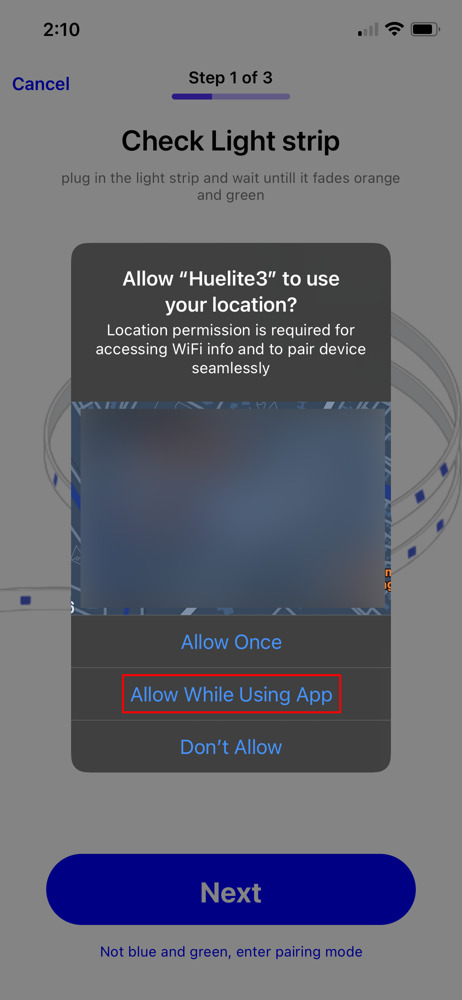

<hint color="#48C9B0" >
This guide demonstrates the pairing process for HUElite app <strong>vesion 3.0 or greater</strong>. If your app happens to be lower version than 3.0 than kindly follow the <glink link="/support/how_to_pair/v2"><u>HUElite version 2 pairing guide here</u></glink>

</hint>

#### <step>Step 1:</step> Download the Huelite Application from Play Store/App Store respectively.

- [HUElite app for Ios](https://apps.apple.com/in/app/huelite-3-0/id1627075117)

- [HUElite app for Android](https://play.google.com/store/apps/details?id=com.sternet.huelite3)

&nbsp;

#### <step>Step 2:</step> Once the app is installed , register an account with Huelite, or login with an existing account.

&nbsp;

  

    

      
    

    

      
    

  

&nbsp;

&nbsp;

#### <step>Step 3:</step> Tap on “+” sign top right corner or “Add Device” button as shown below

&nbsp;

  

        
  

&nbsp;

&nbsp;

- If its your first start you will be landed on pairing screen, automatically, if not on pairing screen than, Click the **add device** icon on the top right-most corner of **dashboard**

&nbsp;

#### <step>Step 4:</step> Make sure the Smart Strips are blinking and then tap “Next”. If the Lights are not flashing, Tap on the button “Not blue and green, enter pairing mode” which will forward you to the reset instructions page.

&nbsp;

  

        
  

&nbsp;

&nbsp;

#### <step>Step 5:</step> Allow location access to huelite application and allow your phone to connect to huelite device wi-fi.

&nbsp;

  

    

      
    

    

      
    

  

&nbsp;

&nbsp;

#### <step>Step 6:</step> Now wait for upto 45 seconds, and let the device connect automatically.

&nbsp;

  

    

      
    

    

      
    

  

&nbsp;

<hint>
  
Make sure mobile data is turned off & the distance between the led strip and home Wi-Fi shouldn’t be greater than 4 meters while pairing. <glink link="/support/how_to_pair/v3/troubleshoot/step2"><u>checkout troubleshoot guide</u></glink>

</hint>

&nbsp;

&nbsp;

#### <step id="step7">Step 7:</step> Upon successful configuration a lot of Wi-Fi will appear. Choose your 2.4GHz Wi-Fi and enter password.

&nbsp;

  

    

      
    

    

      
    

  

&nbsp;

<hint>
  <h4 >Only 2.4G wifi is supported with WPA/WPA2 encryption security. Ensure following points</h4>
  
- Your phone should be connected with “HUElite” Wi-Fi while entering password. If not, connect manually and then enter home network password.

  
- Make sure that only one unpaired device is ON at a time

  
- The signal range of the home network should be greater than -60dB for some smooth connectivity experience, If the signal is weak you’ll need a wifi booster.

  
- Open networks are not supported. Consider choosing a Wifi with WPA/WPA2 password encryption scheme

  
Follow the <glink link="/support/extended/pairing_troubleshoot?step=step7"><u>troubleshoot</u></glink> if you are facing issues on this step.

</hint>

&nbsp;

#### <step>Step 8:</step> Successful configuration will appear. Set the name of the lights. After it will be directed to the Smart Light Dashboard.

&nbsp;

  

    

      
    

    

      
    

    

      
    

  

&nbsp;

&nbsp;

&nbsp;

## Your device is successfully paired! Enjoy!!

&nbsp;

&nbsp;

