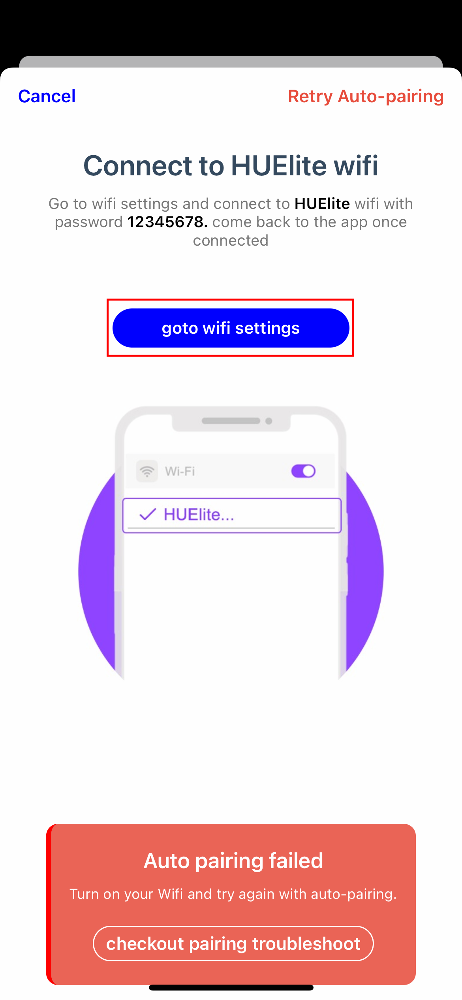
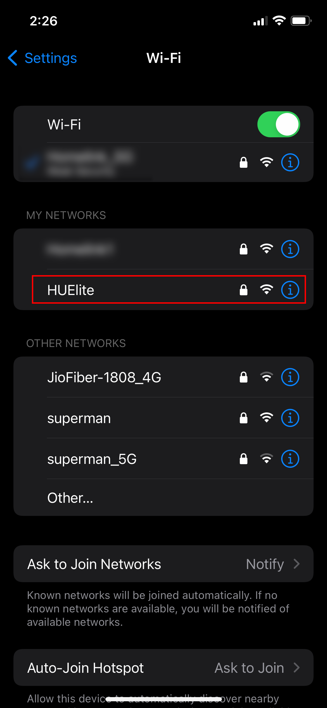

&nbsp;

<hint>
<h4>Make sure of these points</h4>

- Make sure mobile data is turned off.

- Make sure location access is granted.

- Make sure Wi-Fi is ON.

- The distance between the led strip and home Wi-Fi shouldn’t be greater than 4 meters while pairing.

</hint>

&nbsp;

<h4 style="margin-bottom:0px; font-weight:500;">Still unable to proceed forward? You can also complete pairing via manual process.</h4>
<h1 style="margin-top:15px; margin-bottom:0px;">Follow the guide to complete pairing from this step</h1>

&nbsp;

#### <step>Step 1:</step> Tap the “goto wifi settings” button, which will direct you to the Wi-Fi settings.

&nbsp;

  

        
  

&nbsp;

&nbsp;

#### <step>Step 2:</step> Choose the “HUElite” Wi-Fi from the list and connect by entering password 12345678

&nbsp;

  

        
  

&nbsp;

&nbsp;

#### <step>Final step:</step> Then come back to the Huelite 3.0 app and wait for 10-15 seconds the screen will automatically forward to <glink link="/support/how_to_pair#step7"><u>Step7</u></glink>

&nbsp;

&nbsp;

## As screen moves forward, we have resolved the issue

&nbsp;

&nbsp;

