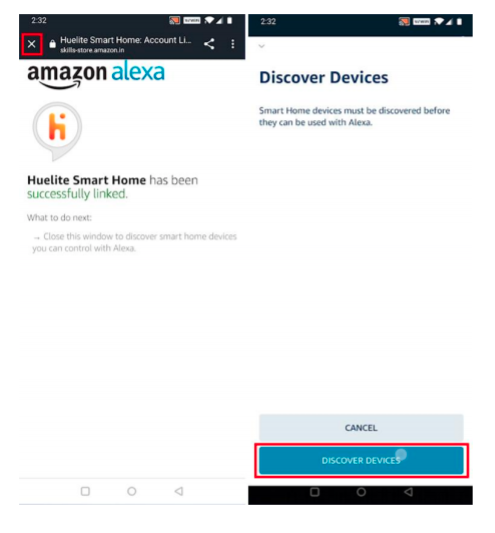
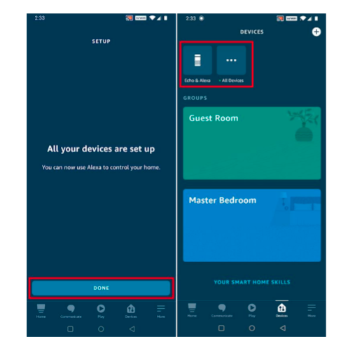

- `NOTE: Huelite account is necessary for Alexa linking.`

<NoteBox heading="Before You Set Up Alexa" color="#76D7C4">

&nbsp;

<h4 style={{ marginTop: 10 }}>
        Verify that you have HUElite app installed and your HUElite smart device is connected to internet
      </h4>
      <ul>
        <li>
          

            To start with HUElite app, follow this guide <Link to="/support/how_to_pair">here</Link>
          

        </li>
      </ul>
      <h4 style={{ marginTop: 30 }}>Ensure that your Alexa device is configured</h4>
       <ul>
        <li>
          

            Alexa app is required to complete the linking process
          

        </li>
        <li>
          

            To setup your alexa device, follow this guide here <Link to="https://www.hellotech.com/guide/for/how-to-set-up-alexa-on-echo">here</Link>
          

        </li>
      </ul>

</NoteBox>

&nbsp;

#### `Step 1` Open the alexa app and go to the “More” tab and then select “Skills & Games”.

&nbsp;

#### `Step 2` Tap the search icon in the top right corner & Search “huelite”.

&nbsp;

- You can find the HUElite Alexa skill [here](https://www.amazon.in/Sternet-Industries-India-PvtLtd/dp/B09232RPS3/ref=sr_1_1?crid=27RSQCGYCBUSO&dchild=1&keywords=huelite+smart+home&qid=1620464925&s=digital-skills&sprefix=huelite%2Calexaskills%2C293&sr=1-1)

#### `Step 3` Select “huelite” and tap “ENABLE TO USE” to enable the Skill.

&nbsp;

#### `Step 4` You will be redirected to the account linking page. Tap on “AGREE & CONTINUE”, then type in your Huelite account & password, then tap “LOGIN”.

&nbsp;

#### `Step 5` Tap on close icon, now Alexa needs to discover your smart devices before it controls them. You can tap on “DISCOVER DEVICES”.

&nbsp;

#### `Step 6` The discovered devices will be shown in the list. Tap on your device to complete setup process.

&nbsp;

#### `Done` Now you can control your smart devices through Alexa. You can use the following commands to control your device (e.g., Bedroom light):

&nbsp;

- **Alexa, turn on/off bedroom light.**

- **Alexa, set bedroom light to 50 percent.**

- **Alexa, brighten/dim bedroom light.**

- **Alexa, set bedroom light to green.**

<NoteBox heading="Troubleshoot">

&nbsp;

<h4 style={{ marginTop: 10 }}>
        Device name not updated after changing the name from HUElite app
      </h4>
      <ul>
        <li>
          

            Upon renaming device from HUElite app you will be required to Re-discover devices from your Alexa
          

        </li>
         <li>
          

            Ask alexa to discover device with the following command, <h4>Alexa, Discover devices</h4>
          

        </li>
         <li>
          

            you can also update your device name from inside the Alexa app. To know how to rename device from Alexa app, follow this guide <Link to="https://www.amazon.in/gp/help/customer/display.html?nodeId=GSH36WER6NKGTFXS" >here</Link>
          

        </li>
      </ul>

</NoteBox>
