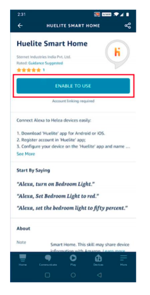
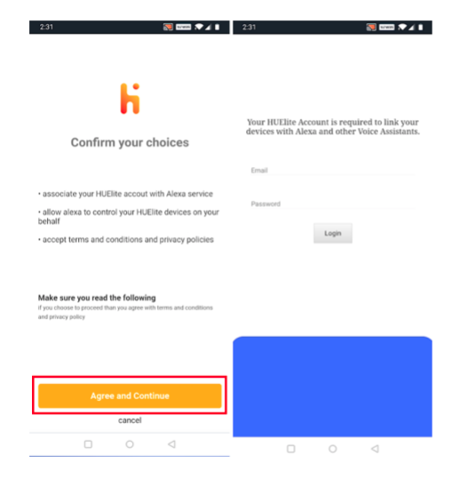
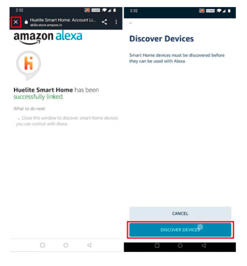
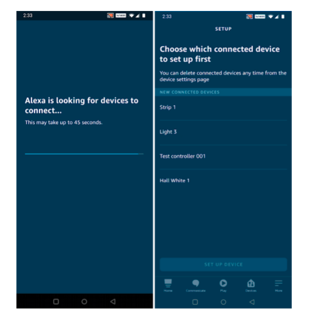
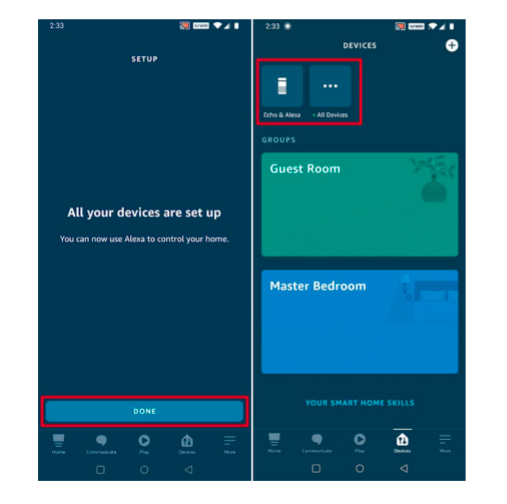

<NoteBox color="#76D7C4">

<h2 style="margin-top:20px;">Before You Set Up Alexa</h2>

<h4 style={{ marginTop: 20, fontFamily:"Ubuntu" }}>Ensure that HUElite device is paired with Internet</h4>
<ul>
  <li>
    

    To start pairing, follow this guide <Link to="/support/how_to_pair">here</Link>
    

  </li>
  <li>
    

    You HUElite account will be used to link your device to alexa. Keep your Login credentials handy.
    

  </li>
</ul>
<h4 style={{ marginTop: 20, fontFamily:"Ubuntu" }}>Ensure that your Alexa device is configured</h4>
  <ul>
  <li>
    

      Alexa app is required to complete the linking process.
    

  </li>
  <li>
    

      To setup your alexa device, follow this guide here <Link to="https://www.hellotech.com/guide/for/how-to-set-up-alexa-on-echo">here</Link>
    

  </li>
</ul>

</NoteBox>

&nbsp;

&nbsp;

#### <step>Step 1:</step> Open the alexa app and go to the “More” tab and then select “Skills & Games”.

  

        
  

#### <step>Step 2:</step> Tap the search icon in the top right corner & Search “huelite”.

&nbsp;

- You can find the HUElite Alexa skill [here](https://www.amazon.in/Sternet-Industries-India-PvtLtd/dp/B09232RPS3/ref=sr_1_1?crid=27RSQCGYCBUSO&dchild=1&keywords=huelite+smart+home&qid=1620464925&s=digital-skills&sprefix=huelite%2Calexaskills%2C293&sr=1-1)

  

        
  

#### <step>Step 3:</step> Select “huelite” and tap “ENABLE TO USE” to enable the Skill.

  

        
  

#### <step>Step 4:</step> You will be redirected to the account linking page. Tap on “AGREE & CONTINUE”, then type in your Huelite account & password, then tap “LOGIN”.

  

        
  

#### <step>Step 5:</step> Tap on close icon, now Alexa needs to discover your smart devices before it controls them. You can tap on “DISCOVER DEVICES”.

  

        
  

#### <step>Step 6:</step> The discovered devices will be shown in the list. Tap on your device to complete setup process.

  

        
  

#### <step>Done:</step> Now you can control your smart devices through Alexa. You can use the following commands to control your device (e.g., Bedroom light):

&nbsp;

&nbsp;

- **Alexa, turn on/off bedroom light.**

- **Alexa, set bedroom light to 50 percent.**

- **Alexa, brighten/dim bedroom light.**

- **Alexa, set bedroom light to green.**

  

        
  

<NoteBox >
  <h2 style="margin:20px 0px;">Troubleshoot</h2>
  <h4 style={{ marginTop: 10 }}>Device name not updated after changing the name from HUElite app.</h4>
  <ul>
    <li>
      

        Upon renaming device from HUElite app you will be required to Re-discover devices from your Alexa
      

    </li>
      <li>
      

        Ask alexa to discover device with the following command, <h4>Alexa, Discover devices</h4>
      

    </li>
      <li>
      

        you can also update your device name from inside the Alexa app. To know how to rename device from Alexa app, follow this guide <Link to="https://www.amazon.in/gp/help/customer/display.html?nodeId=GSH36WER6NKGTFXS" >here</Link>
      

    </li>
  </ul>
</NoteBox>
