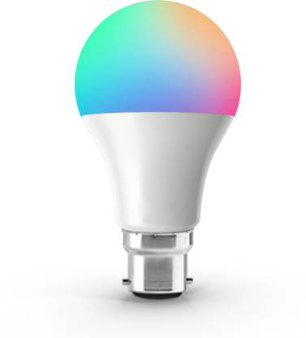

The Indian smart home market is expected to be around $6 billion by 2022, a two-fold increase from $3 billion estimated in 2020, according to Statista. Globally, that number is expected to reach \$53.45 billion by 2022.

**Industry Trends**

The smart lighting market is driven by stringent government regulations across the globe to restrict the use of incandescent lighting technologies. The government across the globe are constantly working to phase out inefficient lamps such as incandescent and halogen lamps, promoting the use of environmental lighting lamps.

The government authorities are also offering tax rebates and subsidies to promote the use of more efficient lighting technologies across the globe. This serves as a major driver for the growth of the market.

The rapid surge in the number of smart city development initiatives and investments has further accelerated the adoption of the market. As industrialization and urbanization are increasing, the energy consumption across the cities is also rising. It is estimated that cities account for more than 60% of the world&#39;s energy and lighting alone consumes 19% of the world&#39;s electricity. To reduce energy consumption and effectively manage resources, governments are leveraging on advanced technology solutions to manage assets and resources more effectively. This is encouraging the development of smart city initiatives across the globe, which will aggregate the demand for smart lighting industry.

**By Components**

Hardware is leading the component landscape with more than 80% share in the smart lighting market in 2018. The growth of the market is attributed to the wide adoption of smart bulbs, smart strip, smart ceiling lights and other connected luminaire among residential &amp; commercial sectors. The integration of advanced technologies, such as Bluetooth, Wi-Fi into lighting solutions is one of the major factors driving the market growth. This allows the smart lights to be controlled through mobile apps and individual lights can be programmed to change the output as per the requirements without the use of any external hub. Moreover, the cost-effective nature and the energy efficiency of smart lights are augmenting their demand in the market. It is expected that the more than 250 million-unit smart bulbs will be sold by 2025.

The software market will grow at a CAGR of more than 22% during the forecast timeline. The market is driven by the growing adoption of smart home and business automation solutions across the globe. Over the past five years, there has been a sudden increase in the integration of the IoT devices into residential &amp; commercial sectors. The consumers are using connected devices to reduce energy consumption and remotely manage their appliances from remote locations. This software allows users to control the intensity of lamps and luminaires as per the infrastructure, ambiance, and intensity of the light. Moreover, the advent of lighting as a service solution along with the proliferation of mobile apps to control the lighting is also serving as a major driver for the growth of the software market.

When smart bulbs were first launched about 16 months ago, they cost as high as Rs 2,400. A year ago, the price of a 7-watt bulb dropped to Rs 1,200. Now it&#39;s has almost dropped under Rs 500.

**By Technology**

The wireless technology will grow at a CAGR of more than 21% during the forecast period. The growth of the market is driven by the growing adoption of wireless connectivity for lighting applications. The lighting manufacturers are shifting from traditional lighting control protocols to sophisticated wireless lighting control systems. Wireless technology offers a natural grid for connectivity and enhances operational efficiency and assists in developing new business avenues. The wireless technology also offers multiple benefits as compared to the traditional wired technology including flexibility, cost-effective, easy to install, and security, augmenting its demand in the commercial and residential market space.

**By Application**

Indoor lighting accounts for over 78% share in the smart lighting market. The growth of the market is credited to the growing demand for energy-efficient lighting solutions across residential and commercial sectors. The businesses and homes are leveraging smart lighting solutions to reduce energy consumption as it saves energy by using need-based light management systems. The systems detect and collect real-time data about the occupants, light-field sensing, and sunlight to optimize the required light output. The product also enable indoor navigation that enables directional access and improves information in high-traffic buildings.

Outdoor lighting will grow at a CAGR of approximately 20% during the projection timeline. The growth of the market is driven by the growing smart city development initiatives across the globe. The smart lighting solutions are widely used across highways &amp; roadways, bridges &amp; tunnels, and public places to reduce energy consumption. The rising need among the government authorities to optimize the use of energy and remotely manage lighting resources has further accelerated the adoption of the industry.

**Conclusion**

Smart lighting has emerged as one of the most disruptive technologies over the past five years. Advanced LED lights are offering a significant bottom-line saving in terms of energy costs. These units are being offered by companies as a part of IoT systems for enabling highly connected infrastructure. This provides users with extra control to effectively manage smart lighting systems. With cheaper &amp; smarter lights rapidly replacing Compact Fluorescent Lamps (CFL) and incandescent bulbs, smart and connected digital lighting using IoT is expected to bring an excellent intelligence and functionality into lighting systems.

This is the best to start your venture into smart lighting as the potential of this industry is doubling in every 2-3 years. You can take the advantage of being the first mover in the Indian market. Our government is making plans under the **Aatmanirbhar Bharat** scheme is making the environment more &amp; more suitable for growth.
