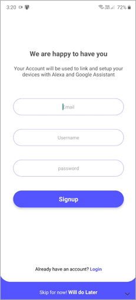
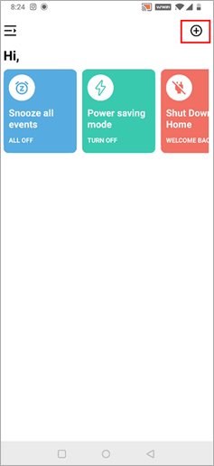
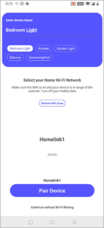
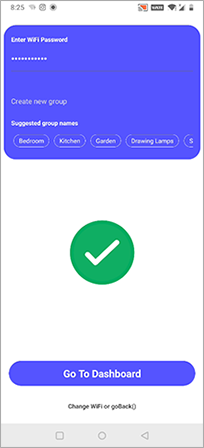

# Checkout tutorial video

<iframe src="https://www.youtube.com/embed/pUpazjj4Gnc" frameborder="0" allowfullscreen ng-show="showvideo" style="margin-top:25px;"></iframe>

**Step 1**: Download the Huelite Application from Play Store/App Store respectively.

- [HUElite app for Ios](https://apps.apple.com/in/app/huelite/id1556187847)

- [HUElite app for Android](https://play.google.com/store/apps/details?id=com.sternet.huelite)

**Step 2**: Register your account with Huelite.

**Step 3**: Now click the **add device** icon on the top right-most corner.

**Step 4**: Go to the Wi-Fi settings of your smartphone and search for **HUE_XXXX**. Connect with this network by entering password **12345678.** Assuming your smart light is plugged on.

<NoteBox compId="faq_devicenotvisible1_v1" heading="Troubleshoot">

 <h4 style={{ marginTop: 10, marginBottom: 10 }}>
        FAQ: Huelite device doesn't appear in the avaliable Wi-Fi network list?
      </h4>
      <ul>
        <li>
          

            Make sure the Huelite device is installed within your home network
            range. (While pairing your smartphone is required to be within 5
            meter radius of huelite device providing no direct obstruction)
          

        </li>
        <li>
          

            If the device Wi-Fi doesnt appear in the Wi-Fi settings kindly
            factory reset the device. Check <Link to="/faq/howtoreset">here</Link>
          

        </li>
      </ul>
</NoteBox>

**Step 5**: Once connected, go back to the Huelite application and make sure your **mobile data is turned off** while pairing. Now enter the desired name for your device, and choose your home Wi-Fi network from the list &amp; click pair device button.

**Step 6**: Now enter your choosen home network password &amp; click start pairing button. Wait for 10 seconds until a success message appears.

Your Light is successfully paired! Enjoy!!
